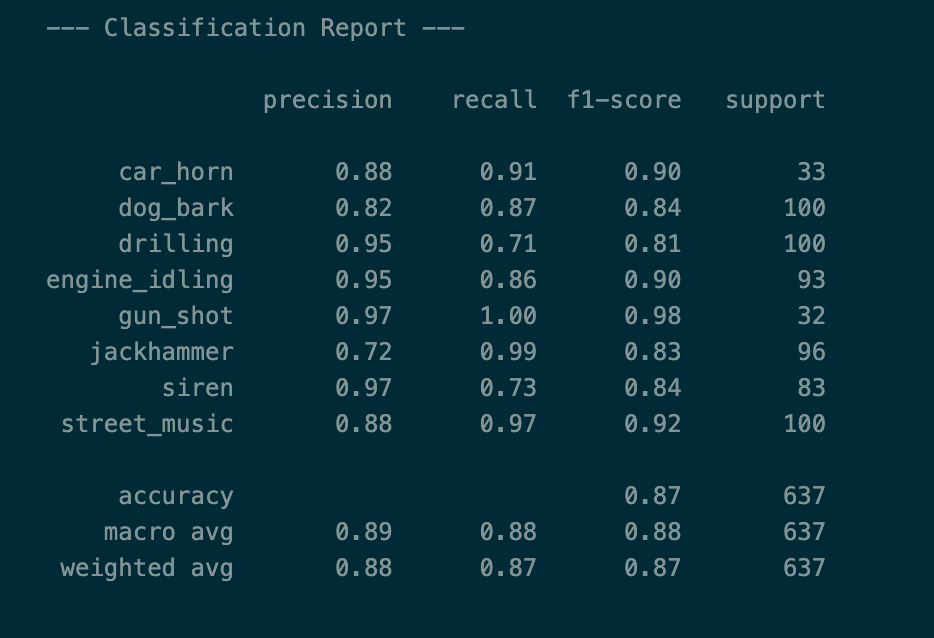

# IPMS - Noise Pollution Classification Module (TinyML)

## Overview

This repository contains the Machine Learning module for the **Intelligent Pollution Monitoring System (IPMS)**. The IPMS monitors environmental conditions, tracking both air quality and noise pollution. This module specifically handles **Audio Classification** using a TinyML approach to deploy on edge devices (ESP32).

It features a lightweight Convolutional Neural Network (CNN) that processes audio spectrograms to classify urban noise sources in real-time.

## Repository Structure

```text
IPMS_ML/
├── README.md                     # Project documentation
├── model.ipynb                   # Notebook for training, evaluation & quantization
├── best_model.keras              # Saved Keras model (Highest validation accuracy)
├── normalization_constants.json  # Mean/Std constants for pre-processing on ESP32
└── results/                      # Performance metrics and graphs
    ├── classification.png
    ├── confusion matrix.png
    └── model summary.png
```

## Target Classes

The model is trained on the **UrbanSound8K** dataset to detect specific urban noise events:

| ID | Label | Description |
| :--- | :--- | :--- |
| 0 | **Car Horn** | Traffic/Driver noise |
| 1 | **Dog Bark** | Neighborhood disturbance |
| 2 | **Drilling** | Construction noise |
| 3 | **Engine Idling** | Stationary vehicle noise |
| 4 | **Gun Shot** | Security alerts |
| 5 | **Jackhammer** | Heavy construction noise |
| 6 | **Siren** | Emergency vehicle detection |
| 7 | **Street Music** | Public activity |

## Technical Approach

### 1\. Preprocessing

Audio clips (4 seconds @ 16kHz) are converted into **Log Mel-Spectrograms**:

  * **Input Shape:** `(126, 64, 1)`
  * **Mel Bands:** 64
  * **FFT:** 2048 / **Hop:** 512

### 2\. Model Architecture

A custom CNN architecture optimized for embedded systems, featuring:

  * **Spatial Dropout:** To prevent overfitting on audio feature maps.
  * **Global Average Pooling:** To minimize model size (removing heavy dense layers).
  * **L2 Regularization:** To ensure weight stability for quantization.

### 3\. TinyML Quantization

The notebook converts the high-precision Keras model into a **TensorFlow Lite (`.tflite`)** model using **INT8 Quantization**. This reduces the model size to fit within the limited memory of the ESP32.

## Results

The model evaluates highly on the validation fold (Fold 10), demonstrating robustness across all classes.


### Confusion Matrix

The confusion matrix visualizes the model's prediction accuracy for each class versus the actual labels. High values along the diagonal indicate correct predictions.


### Detailed Metrics

For a granular view of Precision, Recall, and F1-Scores per class, see the classification report below:




## Usage

1.  **Dependencies:**
    ```bash
    pip install tensorflow pandas numpy librosa seaborn matplotlib scikit-learn
    ```
2.  **Data:**
    Place the **UrbanSound8K** dataset in the root directory.
3.  **Training:**
    Run `model.ipynb` to train the CNN and export the quantized TFLite model.
4.  **Deployment:**
    Use the `normalization_constants.json` to normalize audio input on the ESP32 before passing it to the TFLite interpreter.

## Integration

This module acts as the audio intelligence unit for the IPMS. It outputs classification IDs that are transmitted via MQTT/LoRa (depending on configuration) to the central dashboard for noise pollution analysis.

## License

This project is part of the IPMS system. Rights reserved.